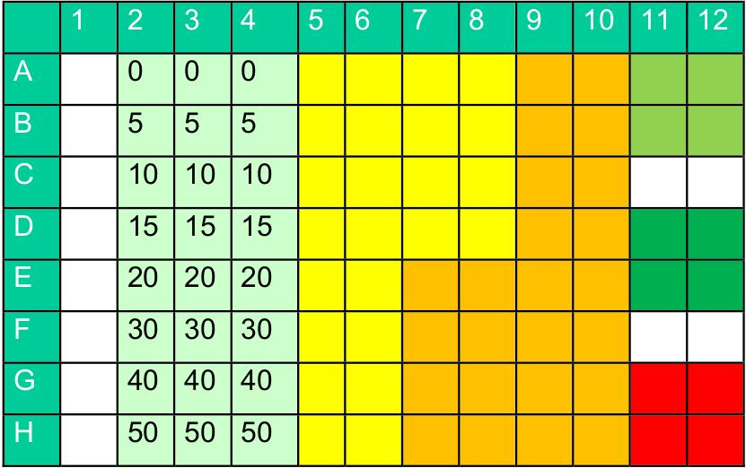

```{r setup, include=FALSE}
knitr::opts_chunk$set(echo = TRUE)
```

# Laden benötigter Pakete

In diesem Intro werden wir mit dem Paket Biotech arbeiten, dieses installieren wir mit:
```{r , eval = FALSE}
# devtools::install_github("https://github.com/Utzi1/Biotech")
devtools::load_all("~/Bachelor/Biotech")
```
Installieren müssen wir es nur ein Mal, danach jedoch müssen wir in jedem Skript, in welchem es zum Einsatz kommt, auf seine Existenz verweisen, wir müssen es "laden":
```{r message=FALSE, warning=FALSE, paged.print=FALSE}
library(Biotech)

# Wir laden auch tidverse, dieses Paket enthält eine Menge
# nützlicher Funktionen
library(tidyverse)
```
# Teaser

## Rohdatenverarbeitung

Ihr habt im Labor den Bradford-Assay durchgeführt und mit Rinderserumalbumin eine Standardreihe aufgenommen, dazu wurden zu jeder Verdünnung vier technische Replikate angefertigt und deren Absorption gemäß der Vorschrift gemessen.
Die Ergebnisse der Messung lauten:
```{r echo=FALSE}
Std <- tibble(
  mes.1 = c(0.031,	0.092,	0.191,	0.278,	0.332, 0.363),
  mes.2 = c(0.04, 0.103, 0.201, 0.279, 0.348, 0.36),
  mes.3 = c(0.009, 0.077, 0.166, 0.205, 0.25, 0.397), 
  mes.4 = c(0.007, 0.084, 0.166, 0.205, 0.353, 0.371),
  )
conc <- seq(
            # die geringste Konzentration
            from = 0,
            # die Höchste Konzentration
            to = 100,
            # die Länge
            length.out = 
                # diese muss der Anzahl der Messungen entsprechen
                length(Std$mes.1)
            )
Std$"conc" <- conc
pander::pander(Std)
```

Diese fassen wir gleich als tibble zusammen:
```{r}
Std <- tibble(
  mes.1 = c(0.031,	0.092,	0.191,	0.278,	0.332, 0.363),
  mes.2 = c(0.04, 0.103, 0.201, 0.279, 0.348, 0.36),

  mes.3 = c(0.009, 0.077, 0.166, 0.205, 0.25, 0.397), 
  mes.4 = c(0.007, 0.084, 0.166, 0.205, 0.353, 0.371),
  )
```
Zusätzlich dazu brauchen wir eine Vector, welcher Information über die Konzentration des BSA in den angesetzten Standards (in $\frac{\mu g}{ml}$) bereithält:
```{r}
conc <- seq(
            # die geringste Konzentration
            from = 0,
            # die Höchste Konzentration
            to = 100,
            # die Länge
            length.out = 
                # diese muss der Anzahl der Messungen entsprechen
                length(Std$mes.1)
            )
```

Die Länge (also Anzahl der einzelnen Werte muss der Anzahl der Standards entsprechen) wird über das Argument length.out gesteuert.
Als Nächstes berechnen wir das arithmetische Mittel der technischen Replikate:
```{r}
Std.mean <- rowMeans(Std)
```

## Errechnen eines Linearen Modell

Damit haben wir nun alles um ein lineares Modell vom Typ $y = m \cdot x + b$ zu errechnen und zu plotten, dies geht recht leicht:
```{r message=FALSE, warning=FALSE, paged.print=TRUE}
# Berechnen des Modells
LinMod(abs = Std.mean, conc = conc) %>%
    # Überführen des Modells in eine schöne Tabelle
  pander::pander()

# Plotten des Modells
plot_regression(abs = Std.mean, conc = conc)
```

## Konzentrationsbestimmung der Proben

Nach dem selben Verfahren wie die Standardreihe wurde auch mit Proben unbekannter Konzentration verfahren, für diese wurden folgende Absorptionswerte gemessen:
```{r message=FALSE, warning=FALSE}
# die gemessenen Werte:
mes.1 <- c(0.185, 0.245, 0.399, 0.429, 0.448, 0.431)

# definieren des Verdünnungsfaktor
FV <- c(80, 80, 40, 40, 20, 20)

# Hieraus berechnen wir dann direkt die Konzentrationen:
conc.mes <- 
    conc_eval(abs_P = mes.1, abs_std = Std.mean, conc_std = conc)

conc.rea <- 
    conc.mes * FV

# Erzeugen einer Ausgabe
print(conc.rea)
```
Bei genauerer Betrachtung fällt auf, dass die Werte, welche zu den geringeren Verdünnungen gehören viel geringere Konzentrationen aufweisen, als jene der schwachen Verdünnungen.
Dies lässt sich damit erklären, dass der Bradford Assay nur innerhalb eines bestimmten linearen Bereichs zuverlässige Ergebnisse liefert.
Dieser liegt in der Regel unterhalb einer Konzentration von $120 \frac{\mu g}{ml}$, ein Vergleich der Messwerte mit den theoretischen Konzentrationen ist dabei hilfreich.
 
Eine Einführung in R
====================

Skript, Konsole & Interpreter
-----------------------------

R ist eine interpretierte Sprache, das bedeutet, dass ein Interpreter
die Statements, welche an ihn gegeben werden, interpretiert. Wenn man
nun R in seiner ursprünglichsten Form haben will, so bekommt man es als
Kommandozeilen-Interpreter. Dazu muss man `R` lediglich installieren und
in einer [TE]{acronym-label="TE" acronym-form="singular+short"} `R`
eingeben und Enter drücken. Dadurch wird der Interpreter *erweckt* und
steht zur Verfügung. Wie das aussehen kann, soll durch
[\[app::Kommandozeile\]](#app::Kommandozeile){reference-type="ref"
reference="app::Kommandozeile"} nachvollziehbar gemacht werden.
Innerhalb dieser Umgebung gilt nun R, allerdings soll gesagt sein, dass
diese Umgebung nichts für Tippfaule ist, sie ist als Taschenrechner
ebenso verlässlich wie für etwas umfangreichere Aufgaben. Ein R-Skript
wird durch zwei grundlegende Informationen geprägt:

Dateiendung

:   Das Skript selbst ist eine Textdatei, diese endet mit `.R`, so wie
    eine Excel-Datei auf `.xsxl` endet. Die Datei mit Namen
    `irgendwas.R` kann zwar in jedem beliebigen Editor bearbeitet
    werden, wird aber nur erkannt, wenn die Endung korrekt ist.

Inhalt

:   In der Datei, welche auf `.R`, endet finden wir einen von R
    interpretierbaren Text. Der Inhalt muss also konform zur
    R-Language-Definition [@R_gen] sein.

Wenn man dann das Skript geschrieben hat, kann es zum Beispiel über den
Kommandozeilen-Interpreter interpretiert werden, bewerkstelligt wird das
dann über `source("Pfad/zur/Datei")`. Wenn man sich in einem
[IDE]{acronym-label="IDE" acronym-form="singular+short"} befindet, wie
zum Beispiel R-Studio, erfolgt das Bearbeiten und Interpretieren von
Skripten interaktiv.

Grundlegende Begriffe
---------------------

Die recht gut nachvollziehbare Syntax kann gerade auch fachfremden
Anwendern den Beginn enorm erleichtern, bereits ein paar Kenntnisse der
englischen Sprache reichen teilweise aus, um viele der Befehle zu
verstehen, einige besonders wichtige Zeichen (Operatoren) und
Grundfunktionen wollen wir uns jedoch explizit ansehen:

`+ - * /  ̂%% %/%`

:   Sind die arithmetischen Operatoren *plus*, *minus*, *mal*,
    *geteilt*, *hoch*, *Modulus* (Teilen mit Rest) und die *ganzzahlige
    Division*.

`<-`

:   Ordnet innerhalb einer Umgebung zu, er ist der gebräuchlichste
    `assignment operator`.

`< > <= >= == !=`

:   Sind relationale Operatoren für *kleiner als*, *größer als*,
    *kleiner gleich*, *größer gleich*, *exakt gleich* und *ungleich*.

`& | !`

:   Sind logische Operatoren für *und* , *oder* und *nicht*.

`[] $`

:   Sind subsetting-Operatoren.

`function()`

:   Erzeugt eine Funktion.

`if() else()`

:   Sind Bedingungen.

`for()`

:   Erzeugt eine `for`-Schleife.

`while()`

:   Erzeugt eine `while`-Schleife.

`#`

:   Markiert den Beginn eines Kommentars.

Alle gelisteten Begriffe sind *reserviert*, das bedeutet, dass sie zum
Beispiel mittels einer Zuordnung durch einen Pfeil nicht überschrieben
werden können. Es gibt weitere *Reserved Words in R*, diese können durch
`?reserved` ausgegeben werden.

### Zuweisungen

Ein weiterer reservierter Begriff ist `NA`. Wenn wir versuchen, `NA` mit
einer neuen Variable zu überschreiben bekommen wir eine Fehlermeldung:

    > NA <- 1
    Fehler in NA <- 1 : ungültige (do_set) linke Seite in Zuweisung

Das Selbe wird auch bei den anderen reservierten Begriffen passieren.
Eine Zuweisung kann auch in eine andere Richtung erfolgen:

    > c(1, 2, 3) -> x
    > x
    [1] 1 2 3
    # das geht nicht:
    > y -> c(1, 2, 3)
    Fehler: Objekt 'y' nicht gefunden

Das 2. Statement hingegen weist schlichtweg in die falsche Richtung.

    # auch das gleich ist in der Lage eine Zuweisung vorzunehmen
    > x = c(1, 2, 3)
    # x wird nun auf y übertragen
    > x -> y
    > y
    [1] 1 2 3
    # x bleibt bestehen
    > x
    [1] 1 2 3
    # sind die beiden exakt gleich?
    > x == y
    [1] TRUE TRUE TRUE
    # Ja!

Es ist empfehlenswert sich, gerade zu Beginn, mit einfachen Operationen
ein Bild von der Funktion der Sprache zu machen und die Operatoren zu
nutzen, um sie kennen zu lernen.

### Vektoren und deren Subsetting

Unter Subsetting versteht man das Bilden kleiner Untereinheiten
(subsets) aus größeren Sets (Datensets), im einfachsten Fall ein Vektor:

    > x <- c(1:6)
    # Subsets nach Position
    > x[2:3]
    [1] 2 3
    # ein Subset als Zuweisung
    > y <- x[1:4]
    > y
    [1] 1 2 3 4

Den Elementen eines Vektors können auch Namen gegeben werden, das
geschieht über `names()`:

    > names(x) = c("eins", "zwei", "drei", "vier", "fünf", "sechs")
    > x
     eins  zwei  drei  vier  fünf sechs 
        1     2     3     4     5     6 
    # nun lassen wir uns den Wert zum Namen ausgeben
    > x["zwei"]
    zwei 
       2 
    # !!ACHTUNG!! der Name wird nur als String erkannt 
    > x[zwei]
    Fehler: Objekt 'zwei' nicht gefunden
    # die Namen werden auf neue Objekte übertragen
    > y <- x[1:4]
    > y
    eins zwei drei vier 
       1    2    3    4

**Namen** = `string`?! Ja, korrekt geraten, der Begriff `string`
bedeutet, dass es sich um eine Reihe von Buchstaben handelt. Für eine
Reihe von Buchstaben gelten andere Regeln als für `numeric`'s (Zahlen,
diese werden auch als `double`) bezeichnet. Grundsätzlich gilt für
`strings`, dass sie eben in Anführungszeichen weiter gegeben werden:

    > Satz <- "Ich bin ein String"
    > Satz
    [1] "Ich bin ein String"
    # wobei der String auch anders entstehen kann:
    > Satz.auch <- c("Auch ", "ich ", "bin ein String")
    > Satz.auch
    [1] "Auch ""ich ""bin ein String"
    # der Vektor aus strings kann auch numerics enthalen
    > Satz.auch[2] <- 2
    > Satz.auch
    [1] "Auch " "2" "bin ein String"
    # allrdings ist er erst jetzt ein "echter" Satz
    > paste(Satz.auch, collapse=" ")
    [1] "Auch  ich  bin ein String"
    # man kann den String mit grep durchsuchen
    > grep("2", Satz.auch)
    [1] 2

Höhere Datenstrukturen
----------------------

### Matrices

Eine Matrix ist primär eine zweidimensionale Anordnung von Werten in
Reihen und Spalten. Wenn wir eine solche Matrix entstehen lassen wollen
können wir dazu mit einem Vektor starten:

    > x <- 1:9
    # eine Matrix mit 3 Spalten und 3 Reihen
    > mat.x = matrix(x, nrow = 3, ncol = 3)
    > mat.x
         [,1] [,2] [,3]
    [1,]    1    4    7
    [2,]    2    5    8
    [3,]    3    6    9
    # Transponieren der Matrix
    > t(mat.x)
         [,1] [,2] [,3]
    [1,]    1    2    3
    [2,]    4    5    6
    [3,]    7    8    9
    # Subset, jetzt in zwei Dimensionen
    > mat.x[1:2, 2:3]
         [,1] [,2]
    [1,]    4    7
    [2,]    5    8
    # und noch eins
    > mat.x[3,3]
    [1] 9

### Listen

Der Datentyp `list` ist recht flexibel, er kann salopp gesagt alles
enthalten beispielsweise Matrices, Vektoren, Funktionen und mehr:

    > Liste <- list(
      Funktion = function(x, y){x+y},
      Matrix = matrix(1:9, nrow = 3, ncol = 3),
      Vektor = c(runif(10)),
      )
    > Liste
    $Funktion
    function(x, y){x+y}

    $Matrix
         [,1] [,2] [,3]
    [1,]    1    4    7
    [2,]    2    5    8
    [3,]    3    6    9

    $Vektor
     [1] 0.63860417 0.25105358 0.64089547 0.49214046 0.48232077 0.30024825
     [7] 0.92896802 0.62018010 0.02472022 0.77797613

    # Listen können über das Dollar-Zeichen subsettet werden
    > Liste$Funktion
    function(x, y){x+y}
    # oder über die eckigen Klammern
    > Liste[2]
    $Matrix
         [,1] [,2] [,3]
    [1,]    1    4    7
    [2,]    2    5    8
    [3,]    3    6    9

### Dataframes

Der Dataframe ist eine Sonderform der Liste, alle in ihm enthaltenen
Elemente haben die selbe Länge, er taucht gerade deswegen sehr oft auf.
Sowohl das Subsetting, welches wir bei den Listen kennen gelernt haben,
als auch das Subsetting, welches bei Matrices angewandt wird, kann auch
auf den Typ Dataframe angewandt werden.

Tibble
------

Der `tibble` wird auf der offiziellen Website
`https://tibble.tidyverse.org/index.html` wie folgt beschrieben:

A `tibble`, or tbl\_df, is a modern reimagining of the data.frame,
keeping what time has proven to be effective, and throwing out what is
not. Tibbles are data.frames that are lazy and surly: they do less (...)
and complain more (...).\
[@KirillMueller2020]

Der `tibble` kann also als moderne  Überarbeitung des `data.frame`
verstanden werden. Diese Modernisierung beinhaltete vor allem das faul
machen  der Datenstruktur, welche dazu führt, dass sie öfter Fehler
aufwirft. Der `tibble` ist eine sehr gebräuchliche Datenstruktur im
`tidyverse` [@Wickham2019], eine moderne Paketsammlung, welcher später
noch mehr Aufmerksamkeit geschenkt wird. Die Regeln für das Subsetting
bei `tibble`'s sind die selben wie beim `data.frame`. Um einen `tibble`
aus, zum Beispiel, Messwerten enstehen zu lassen, gilt:

    > tibble(
    + Namen = c("Gustav", "Anna", "Roman", "Veronika"),
    + Alter = c(55, 17, 26, 19))
    # A tibble: 4 x 2
      Namen    Alter
      <chr>    <dbl>
    1 Gustav      55
    2 Anna        17
    3 Roman       26
    4 Veronika    19

Datenimport
-----------

In der Regel liegen Messdaten als [csv]{acronym-label="csv"
acronym-form="singular+short"}-File (.csv), [xslx]{acronym-label="xslx"
acronym-form="singular+short"} oder als handgeschriebenes Manuskript
vor. Das handgeschriebene Manuskript kann gut direkt in die R-Umgebung
übertragen werden, in Form eines `tibble`'s zum Beispiel. Um Daten aus
[csv]{acronym-label="csv" acronym-form="singular+short"}-Dateien zu
importieren, steht `read_csv` aus dem Paket `readr` zur Verfügung. So
kann die Tabelle
[\[app::CSV\_Dat1\]](#app::CSV_Dat1){reference-type="ref"
reference="app::CSV_Dat1"}, welche als [csv]{acronym-label="csv"
acronym-form="singular+short"} dort vorliegt, wie folgt importiert
werden:

    tab.1 <- read_csv("bsp.csv")
    Parsed with column specification:
    cols(
      V1 = col_double(),
      V2 = col_double(),
      V3 = col_double()
    )
    > tab.1
    # A tibble: 3 x 3
         V1    V2    V3
      <dbl> <dbl> <dbl>
    1     1     4     7
    2     2     5     8
    3     3     6     9
    # umkonvertieren in eine Matrix
    > mat <- as.matrix(tab.1)
    > mat
         V1 V2 V3
    [1,]  1  4  7
    [2,]  2  5  8
    [3,]  3  6  9
    # Dimenstionsnamen einführen
    > dimnames(mat) <- list( c("x", "y", "z"), c("a", "b", "c"))
    > mat
      a b c
    x 1 4 7
    y 2 5 8
    z 3 6 9

Für das Einlesen von [xslx]{acronym-label="xslx"
acronym-form="singular+short"}-Datensätzen steht das Paket `readxl` zur
Verfügung, die dort implementierten Funktionen importieren nach einem
ähnlichen Schema wie `read_csv` Excel-Datensätze. Unter Verwendung von
R-Studio wird der Datenimport stark vereinfacht, da dort ein
[GUI]{acronym-label="GUI" acronym-form="singular+short"} den Datenimport
begleitet.

Funktionen und Kontrollstrukturen
---------------------------------

### `if`

`if` untersucht eine Aussage und abhängig vom Ergebnis der Aussage
erzeugt `if` dann eine Ausgabe, ähnlich wie in
[Aschenputtel]{.smallcaps} beim Linsen sortieren zu ihren Täubchen:

...die schlechten ins Kröpfchen, die guten ins Töpfchen.\
[@Grimm2008]

Das hierbei beschriebene Problem könnte in R so gelöst werden:

    > x = "schlecht"
    > if (x == "gut") {
    +   print("ab ins Töpfchen")
    + } else if (x == "schlecht") {
    +   print("ab ins Kröpfchen")
    + }
    [1] "ab ins Kröpfchen"

### `function`

Das `function`-Statement kann [Aschenputtel]{.smallcaps} das Leben
zusätzlich leichter machen, wenn sie Tippfaul ist, kann sie es in einer
Funktion verpacken, welche immer wieder aufgerufen werden kann. Es ist
wichtig zu bedenken, dass später von der Funktion nur der Name sichtbar
ist und aus diesem Grund ein sinnvoller Name wärmstens zu empfehlen ist.
Die Definition einer Funktion erfolgt immer nach dem selben Schema:

    > Name <- function(Argumente){Funktion (body)}
    # oder:
    > Add <- function(a, b) a + b
    > Add(1, 2)
    [1] 3

Im 2. Fall kann auf die geschweifte Klammer verzichtet werden, da die
ganze Definition auf einer Zeile Platz hat und der Sinn durchaus
erhalten bleibt. Für [Aschenputtel]{.smallcaps} könnten wir annehmen:

    > Taube <- function(Linse) {
    +         if (Linse == "gut") {
    +           print("ab ins Töpfchen")
    +         } else if (Linse == "schlecht") {
    +           print("ab ins Kröpfchen")
    +         }
    + }
    > x = "schlecht"
    > Taube(x)
    [1] "ab ins Kröpfchen"
    > y = "gut"
    > Taube(y)
    [1] "ab ins Töpfchen"

### `for`

Das `for`-Statement ermöglicht es, für mehrere Werte wiederholend die
selbe Aufgabe durchzuführen, denn [Aschenputtel]{.smallcaps} hat ja
nicht nur eine Linse, sondern eine ganze Menge. Hierbei soll aber darauf
verwiesen werden, dass der Gebrauch von Schleifen in R eher untypisch
ist, da eine Vielzahl von Funktionen zur Verfügung steht welche, sie
leicht ersetzen können. Dennoch macht es Sinn sich diese Technik
anzueignen. Wenn man sie beherrscht, hann kann man sie häufig sinnvoll
einsetzen. Eine weitere wichtige Information zum Gebrauch von
`for`-Loops bezieht sich auf ihre Ausgabe. Der `for`-Loop ist langsam,
wenn seine Ausgabe nicht zuvor definiert wurde. Das bedeutet im
Umkehrschluss, dass man sich über die Ausgabe Gedanken machen sollte.
Für [Aschenputtel]{.smallcaps} wollen wir nun die `Taube`
automatisieren, damit sie in der Lage ist, einen Vektor aus `Linsen` zu
klassifizieren und diese entweder ins `Kröpfchen` oder `Töpfchen` zu
werfen:

    1> y <- c("gut", "schlecht", "schlecht", "gut", "gut")
    2> Ausgabe <- vector(mode = "list", length = length(y)) 
    3> for (i in y) {
    4>    Ausgabe[[i]] <- Taube(i) 
    4>}
    [1] "Ab ins Töpfchen"
    [1] "Ab ins Kröpfchen"
    # und so weiter

1.  Zu Beginn erstellen wir den Vektor aus `Linsen` welche dann eben
    `schlecht` oder `gut` sind

2.  Der Vektor `y` aus `Linsen` bestimmt die Länge `length` der Ausgabe
    da entsprechend der Anzahl an Linsen auch Klassifizierungen
    vorgenommen werden.

3.  Nun wird in `for` jedes Element `i` (also jede `Linse`) in `y`
    untersucht.

4.  Hier wird definiert, womit untersucht wird, nämlich mit `Taube`.

### `while`

Die `while`-Schleife führt so lange eine Anweisung aus, bis eine
Bedingung erfüllt ist, dabei gilt:

    while(Bedingung){Anweisung}

Diese Bedingung kann [Aschenputtel]{.smallcaps} zum Beispiel dabei
helfen, so lange Linsen zu sortieren, bis sie quantitativ genug davon
hat, um mit diesen einen Eintopf zu kochen. Wir können schreiben:

    1> x = 20
    2> Linsen = 100
    3> while( x != Linsen ){
    4+     print("Esst mehr Linsen")
    5+     x = x + 20
    6+     print(x)
     + }
    [1] "Esst mehr Linsen"
    [1] 40
     usw
    [1] "Esst mehr Linsen"
    [1] 100

Hierbei ordnen wir im ersten Schritt `x` den Wert 20 zu, dabei handelt
es dann um $20$ fiktive Linsen. Wir benötigen allerdings $100$ fiktive
Linsen, diese Zuordnung erfolgt in Schritt `2`. Um diese $100$ fiktive
Linsen zu bekommen definieren wir die Bedingung für den `while`-Loop,
diese bedeutet in Worten: So lange `x` nicht `Linsen` ist  läuft der
Loop. Was der Loop dann macht, ist in den Zeilen $4$ bis $6$ definiert.
In Zeile $4$ wird zu `x` 20 addiert und daraus das neue `x` definiert,
dieses wird dann in $6$ ausgegeben. Dieser Vorgang geschieht so lange,
bis `x != Linsen` nicht mehr stimmt, also sobald $x = 100$ gilt.

Pakete und das `tidyverse`
--------------------------

Wie bereits angesprochen verwendet man in R Pakete als Erweiterung des
Funktions-Repertoires. Diese Erweiterung erfolgt abhängig von den
Ansprüchen des Anwenders und muss dementsprechend vom Anwender
individuell angepasst werden. Eine sehr populäre Paketesammlung, das
`tidyverse`, soll jedoch nicht unbeachtet bleiben. Unter einer
Paketsammlung versteht man den Zusammenschluss mehrerer Pakete zu einem
neuen und größerem Paket. Im Fall des `tidyverse` ist diese Sammlung auf
das *saubere* Verarbeiten von Daten ausgelegt, der Fokus liegt auf einer
verständlichen Syntax und einem anwenderfreundlichen *Code*. Das
`tidyverse` beinhaltet folgende Kern-Komponenten [@Wickham2020]:

`ggplot2`

:   Im Namen versteckt sich bereits ein Hinweis auf das Buch *The
    Grammar of Graphics* von [Leland Wilkinson]{.smallcaps} [@LW2005].
    Auf Basis dieses Buchs werden in `ggplot2` die Weichen für eine
    verbesserte Datenvisualisierung gelegt.

`dplyr`

:   Das Paket `dplyr` enthält eine Vielzahl verschiedener Funktionen zur
    Datenmanipulation.

`readr`

:   Das Paket `readr` enthält Funktionen zum Import von Datensätzen.

`tidyr`

:   Das Paket `tidyr` hilft bei der Ordnung von Daten.

`tibble`

:   Der `tibble` wird in [1.4](#tibble){reference-type="ref"
    reference="tibble"} genauer erklärt.

`purr`

:   Das Paket `purr` ermöglicht weitere Schritte in Richtung
    funktionales Programmieren.

`stringr`

:   Der Name verrät es bereits: es geht um `string`'s, um das
    Programmieren mit diesen zu vereinfachen, wird dieses Paket zur
    Verfügung gestellt.

`forcats`

:   Das Paket `forcats` stellt Tools zur Arbeit mit `factor`'s zur
    Verfügung.

Die Pakete `ggplot2` und `dplyr` finden in `Biotech` viel Anwendung,
dazu später mehr.

## Einfache Übungen

Zu Beginn sollte man sich auf den Gebrauch simpler Operatoren konzentrieren, wenn man sie verstanden hat, wird's später leichter ;-)

```{r}
x = 1
y = 2

x != y
x == y
x < y
x > y
z = 1
x >= z
x <= z
vec1 <- trunc(runif(n = 10, min = 3, max = 7))
vec2 <- trunc(runif(n = 10, min = 3.5, max = 7.7))
vec3 <- trunc(runif(n = 10, min = 3, max = 8))
inf1 <- c(vec1 == vec2)
inf2 <- c(vec2 == vec3)
inf3 <- c(vec1 == vec3)
inf1 &  inf2
inf1 && inf2
inf1 |  inf2
inf1 || inf2
```

Des weiteren stehen uns eine Menge mathematische Grundfunktionen zur Verfügung, diese sollen an dieser Stelle nur stiefmütterlich behandelt werden:

```{r}
# Ihr könnt die trigonometrischen Funktionen nutzen:
par(mfrow = c(1,1))
plot(atan(1:50))
plot(cos(seq(0, 15, .01)), type = "l")

# Man kann toll spielen
Dings1 <- sin(seq(0, 15, .01))
Dings2 <- (sin(seq(0, 15, .01) * .5) * 2.3 )^ 3

# base::par ermöglicht es uns 2 oder mehrere Plots neben einander
# in der selben Grafik unterzubringen
par(mfrow=c(1,2))  
plot(Dings1, type = "l")
plot(Dings2, type = "l")
```

### Funktionen definieren

Das Definieren einer Funktion ist recht Einfach.
Wir möchten hier zusammen anhand des Zylindervolumens exemplarisch vorgehen:

```{r}
# Berechnung von Zylinder-Volumina
h <- 1:10
d <- seq(.444, 10.23, length.out = 10)
    
# Funktion definieren
vol <- function(d, h) pi * (d/2)^ 2 * h
(vol  <- vol(h = h, d = d))
par(mfrow = c(1,1))
plot(vol, h/2)

# Zurück rechnen auf die Höhe
sqrt(((4 * vol) / ( pi * h )))
```

### Funktionen auf Datenstrukturen anwenden 

Hierzu verwenden wir `lapply` oder `sapply`:

```{r}
# Zu Beginn lassen wir Daten entstehen 
liste <- list(a = runif(n = 20, min = 2, max = 5),
          b = 1:6,
          c = rnorm(n = 5))


# Die Mittelwerte über lapply
(x  <- lapply(X = liste, FUN = mean))

# die Mittelwerte über sapply
(y = sapply(X = liste, FUN = mean))

# vergleichen der Ergebnisse 
is(x) == is (y)

# Was ist gleich, was ist anders?
is(x)
is(y)
```

Das Paket `purrr` stellt uns zusätzliche Tools zur Verfügung:

```{R}
# das Paket purrr stellt map() zur Verfügung, ähnlich zu apply()
library(purrr)
map(liste,  mean)
```

## Verteilungsmodelle 

R kennt eine menge verschiedener Verteilungsmodelle, hier ein Paar interessante:

```{r}
# Die Poisson-Verteilung
poissVer <- dpois(x = seq(0, 100, 1), lambda = 50)

par(mfrow=c(1,2))
plot(poissVer)
hist(poissVer)

# Die Normalverteilung
normVer <- rnorm(n = 100, mean = 50, sd = 10)

par(mfrow=c(1,2))
plot(normVer)
hist(normVer)

# geometrische Normalverteilung
geoVer <- dgeom(x = 0:50, prob = .1)
plot(geoVer)
hist(geoVer)

# Chi-Quadrat-Verteilung
chiVer <- dchisq(x = 0:30, df = 15)
plot(chiVer)
hist(chiVer)

# Uniform Verteilung 
unifVer <- runif(n = 100, min = 0, max = 10)
plot(unifVer)
hist(unifVer)

par(mfrow=c(1,5))
# boxplots der Verteilungen
boxplot(unifVer)
boxplot(geoVer)
boxplot(chiVer)
boxplot(normVer)
boxplot(poissVer)
```

Diese Verteilungs-Funktionen können gut genutzt werden, um experimentelle  Daten zu simulieren.

```{r}
m = rnorm(n = 1)
x = sort(
         runif(n = 15, 
               min = 1, 
               max = 13)
) 
b = rnorm(n = 1)
# Werte in einen Kontext bringen:
y <- c(m * x + b) 
# Plotten wir nun mit gglplot
library(ggplot2)
plot1 <- ggplot(mapping = aes( x = 1:15, y = y ))
plot2  <- plot1 + geom_point()
plot2

# Wir können nun eine Regressionsgerade einplotten
plot2 + geom_smooth(method = "lm")

# Und die Parameter "intercept"(=b) sowie "slope"(=m) ermitteln
x <- seq(1,15,1)

# Wir fangen nun an der magrittr-forward-pipe-operator ( %>% ) zu verwenden
library(magrittr)
modell <- lm(y~x)  %>% 
   summary()

# Diese Ergebnisse können auch als Sätzchen formuliert werden:
paste("Das Modell hat die Steigung m",
      paste(modell$coefficients[2]),
      "und einen Schnittpunkt mit der y-Achse bei",
      paste(modell$coefficients[1]))

```
Wir simulieren nun verschiedene Aktivitätsbestimmungen von Typ-Michaelis-Menten-Enzymen:

```{r}
# Mit dieser Funktion möchten wir die Daten generieren
MicMen <- function (S, kM, Vmax) {
    v <- (Vmax * S) / (kM + S)
    return(v)
}

# Wir definieren Substratkonzentrationen:
S1 =  c(.1, .125, .15, .175, .2, .25, .3, .4, .5, .7, 1, 2, 5, 10, 20,   
40, 60, 80, 100)
# Ein fiktives Vmax
vMax1 = 3
# Und ein fiktives kM 
kM1 = .1

MM1 <- MicMen( S = S1, Vmax = vMax1, kM = kM1 ) 

# Wir werden nun das Modell fitten, dies wird über das Paket drc gehen
# install.packages("drc")
library(drc)

Daten <- data.frame( S = S1, v = MM1 )  

fit1 <- drm(
            v~S,
            data = Daten,
            # Hier spezifizieren wir das Modell, ein 2-Parameter MM-Modell
            fct = MM.2()
)

# Wie ist unser Modell nun?:
summary(fit1)

par(mfrow = c(1,1))
plot(fit1)
```


# Auswertung einer 96-Well-Platte

Das Paket Biotech enthält Datensätze welche zum Testen und Experimentieren angefügt wurden, zwei davon sind ELISA-Assays wie sie im Immunologischen Praktikum zum Nachweis vom Humanserumalbumin in Urin entstehen.
Um uns zu verdeutlichen wie groß die Absorptionen in welchen Wells waren können wir durch das anfertigen einer Heatmap schnell die gemessenen Daten visualisiert vor Augen führen.
Eine Heatmap ordnet einem Wert eine Farbintensität zu, hierbei kann die räumliche Anordnung leicht berücksichtigt werden.
```{r}
str(HSA1)
```

## Rohdatenaufarbeitung und Plotten

Um nur die Informationen zu bekommen, die wir benötigen werden wir ein paar Transformationsschritte durchführen:
```{r}
daten <- HSA1[,2:13] %>% 
    as.matrix() %>% 
    as.vector()
```
Nun liegen die Messwerte als Vektor in lineare Form vor, diese können wir in einem Grid "fangen", dazu müssen wir dieses Grid erst mal "aufspannen":
```{r}
# y wird durchnummeriert, als charcter
y  <- paste0(seq(1,12))

# x bekommt die erstest acht Buchstaben des Alphabets
x <- LETTERS[1:8]

# erstellen des Grid
grid.1 <- expand.grid(X = x, Y = y)

# füllen des Grid mit den Daten als Abs
grid.1$Abs <- daten

# plotten des Grid
ggplot( data = grid.1, mapping = aes( X, Y, fill = Abs ) )+
    geom_tile()
```

## Definition einer Funktion

Um in Zukunft schneller das selbe machen zu können schreiben wir eine Funktion welche diese Aufgabe übernimmt.
R ist eine funktionale Programmsprache, das bedeutet, dass es für viele Probleme bereits Funktionen gibt.
Dies erleichtert gerade nicht-Programmierern das schreiben von Skripten.
Sollte nun jedoch, wie in unserem Fall, keine Funktion für das Problem zur Hand sein wird diese einfach geschrieben:

```{r}
    # Name:
vis96 <- 
    # die function-Funktion
    function(
             # Die Argumente der Funktion vis96
             HSA.assay) {
    # die eigentliche Funktion
    daten <- HSA.assay[,2:13] %>% 
    as.matrix() %>% 
    as.vector()
    y  <- paste0(seq(1,12))
    # x bekommt die erstest acht Buchstaben des Alphabets
    x <- LETTERS[1:8]
    # erstellen des Grid
    grid.1 <- expand.grid(X = x, Y = y)
    # füllen des Grid mit den Daten als Abs
    grid.1$Abs <- daten
    # plotten des Grid
    vis96 <- ggplot( data = grid.1, mapping = aes( X, Y, fill = Abs ) )+
        geom_tile()
    # Definition der Ausgabe
    return(vis96)
}
```
Wir können diese Funktion nun testen, dazu verwenden wir den zweiten HSA-Assay (HSA2):
```{r}
vis96(HSA.assay = HSA2)
```

Die Vorteil des Verwendens einer Funktion werden im Beispiel klar:

* die Funktion bedeutet weniger Tippen
* sie macht den Code übersichtlicher

Ein weiterer Vorteil ist, dass die Funktion leicht geändert werden kann, wenn nun zum Beispiel eine Änderung in der Methode (Format der Ausgabe) des Assays eingeführt wird kann die Funktion einfach geändert werden.

## Vergleich mit den zu erwartenden Werten 

Das Originalpipettierschema, in hellgrün die Standardreihe, in gelb und hellgelb die Studentenurinproben und die tieferen grün töne markieren die Auftragungspunkten des Patientenurin, gibt uns eine Idee, welche Messwerte wo zu erwarten sind:


So wird klar, dass beim ersten Test (HSA1) dieses Schema richtig angewandt wurde, abhängig von der Konzentration variiert auch der die Intensität der jeweils gemessenen Zelle.
Besonders klar deutlich wird das anhand der Standardreihen sowie den Patientenproben.
Ins Auge fallen die Werte F5 und F6.
Für den 2. Assay können wir einen ähnlichen Zusammenhang feststellen, auch auf diesem ist vor allem die Standardreihe sichtbar.

# Konzentrationsbestimmung für den HSA-Assay

## Rohdatenverarbeitung

Vor Beginn der Berechnung der HSA-Konzentration in den Proben müssen wir den Mittelwert der Standardreihen berechnen, die Herausforderung besteht hierbei darin die passenden Spalten zu selektieren.
Anhand des Pipettierschemas kann nachvollzogen werden, dass die entsprechenden Auftragungen in den Spalten 2 bis 4 liegen.
```{r}
# wo liegen die Werte der Standards
stdr <- HSA1[3:5]  %>% 
    rowMeans()
```
Aus dieser Standardreihe können wir dann wieder, wie bereits vorher geschehen, eine Regression errechnen:
```{r}
# Zuordnung der Konzentrationen
conc <- c(0, 5, 10, 15, 20, 30, 40, 50)

# welche Konzentrationen gibt das Modell für die Standards aus
conc_eval(abs_P = stdr, abs_std = stdr, conc_std = conc)

# Definition einer Funktion
HSA.conc.eval <- function(HSA,
         mes) {
  stdr <- HSA[3:5]  %>%
    rowMeans()
  conc <- c(0, 5, 10, 15, 20, 30, 40, 50)
  eval <- conc_eval(abs_P = mes,
            abs_std = stdr,
            conc_std = conc)
  return(eval)
}

# Testen der Funktion
HSA.conc.eval(HSA1, HSA1[3:5])
```
Wenn wir uns dieses Ergebnis ansehe, fällt auf, dass die Leerwerte negativ sind, das kann aber (real) nicht sein.

## Vergleichen der Ergebnisse

Um die Ergebnisse zu vergleichen wurde das folgende Skript geschrieben:

```{r}
# Es werden die Ergebnisse zweier unabhängig von einander durchgeführten
# nicht-kompetitven ELISAs errechnet und verglichen

#### ELISA 1 ################################################

# Der HSA1 aus Biotech wird geladen und umbenannt
HSA <- HSA1

# Ausgeben eines Summary:
summary(HSA)

library(tidyverse)

# Errechnen der Mittelwerte für die Standardreihe  
HSA <- mutate(HSA, "Std"=((HSA$s2 + HSA$s3 + HSA$s4) / 3))
HSA.2 <- mutate(HSA, "Std"=((HSA$s2 + HSA$s3 + HSA$s4) / 3))

# Die Spalten 5&6, 7&8 sowie 9&10 führen neben einander die 
# Probenabsorption
Proben.1 <- c((HSA$s5 + HSA$s6)/2 , (HSA$s7[1:4]+HSA$s8[1:4])/2)
Proben.2 <- c((HSA$s9 + HSA$s10)/2 , (HSA$s7[5:8]+HSA$s8[5:8])/2)


# Es ist bekannt, dass Proben.1 1:5000 verdünnt wurde:
Proben.1 <- Proben.1 * 5000

# Proben.2 wurde 1:1000 Verdünnt
Proben.2 <- Proben.2 * 1000
    
# Substratkonzentration
subs <- seq(0, 50, length.out = length(HSA$Std))

# Plot der Regression
plot_regression(abs = HSA$Std[2:8], conc = subs[2:8])

# Definition einer einfachen Funktion
cHSA <- function (abs.P) {
    conc_eval( abs.P, abs_std = HSA$Std, conc_std = subs)
}

# Testen der Funktion
conc.1.1 <- conc_eval( abs_P = Proben.1, abs_std = HSA$Std , conc_std = subs )
conc.1 <- cHSA(abs.P = Proben.1)

# Sind die Ergebnisse die selben?
conc.1 == conc.1.1

# Berechnung der Konzentrationen
conc.2 <- cHSA(Proben.2) 

# Untersuchung der Patienten-Proben
Patient.1 <- (sum(HSA[1:2, 11], HSA[1:2, 12]) / 4) * 20000
Patient.2 <- (sum(HSA[4:5, 11], HSA[4:5, 12]) /4) * 100000

# Berechnung der Patienten-Proben-Konzentration
cHSA(Patient.1)
cHSA(Patient.2)

# Untersuchung der Verteilung der Messwerte
boxplot(conc.1, conc.2, Patient.1, Patient.2)

##### HSA2 ###############################################

HSA.A <- HSA2
summary(HSA.A)

# 2, 3, 4 sind die Standards
HSA.A <- mutate(HSA.A, Std=((HSA.A$s2 + HSA.A$s3 + HSA.A$s4) / 3))
 
# Die Spalten 5&6, 7&8 sowie 9&10 führen neben einander die 
# Probenabsorption
Proben.1.A <- c((HSA.A$s5 + HSA.A$s6)/2 , (HSA.A$s7[1:4]+HSA.A$s8[1:4])/2)
Proben.2.A <- c((HSA.A$s9 + HSA.A$s10)/2 , (HSA.A$s7[5:8]+HSA.A$s8[5:8])/2)

# Es ist bekannt, dass Proben.1 1:5000 verdünnt wurde:
Proben.1.A <- Proben.1.A * 5000

# Proben.2 wurde 1:1000 Verdünnt
Proben.2.A <- Proben.2.A * 1000

# Plot der Regression
plot_regression(abs = HSA.A$Std[2:8], conc = subs[2:8])

# Definition einer einfachen Funktion
cHSA.A <- function (abs.P) {
    conc_eval( abs.P, abs_std = HSA.A$Std, conc_std = subs)
}

# Testen der Funktion
conc.1.A <- cHSA(abs.P = Proben.1.A)

# Berechnung der Konzentrationen
conc.2.A <- cHSA(Proben.2.A) 

# Untersuchung der Patienten-Proben
Patient.1.A <- (sum(HSA.A[1:2, 11], HSA.A[1:2, 12]) / 4) * 20000
Patient.2.A <- (sum(HSA.A[4:5, 11], HSA.A[4:5, 12]) /4) * 100000 

# Berechnung der Patienten-Proben-Konzentration
cHSA(Patient.1.A)
cHSA(Patient.2.A)

####### Vergleich der Ergebnisse ##################################

# als erstes sollten wir überprüfen, dass es sich tatsächlich um 
# zwei verschiedene Datensätze handelt
HSA == HSA.A

boxplot(Patient.1.A ,Patient.1, Patient.2.A, Patient.2)
boxplot(conc.1, conc.1.A)
boxplot(conc.2, conc.2.A)
boxplot(conc.1.A, conc.2.A)
hist(conc.2.A)

library(outliers)
outlier(conc.2.A)


```


## Berücksichtigung des Verdünnungsfaktor

Die Verdünnungsfaktoren sind Bekannt, sie müssen lediglich mit-einberechnet werden.
Man könnte die Funktion zusätzlich erweitern:
```{r}
HSA.conc.eval <- function(HSA,
         mes,
         FV = 1) {
  stdr <- HSA[3:5]  %>%
    rowMeans()
  conc <- c(0, 5, 10, 15, 20, 30, 40, 50)
  eval <- conc_eval(abs_P = mes,
            abs_std = stdr,
            conc_std = conc)
  return(eval * FV)
}

# Testen mit dem zweiten Datensatz
HSA.conc.eval(HSA2, HSA2[3:5])
```
Da nach dem Auftragsschema die Verdünnungsfaktoren auch in den Spalten variieren können müssen wir uns diese noch ein mal genauer ansehen.
```{r}
dat.1 <- tibble(
 "FV1000" = c(rowMeans(HSA2[,6:7]),
              rowMeans(HSA2[1:4, 8:9])
              ),
 "FV5000" = c(rowMeans(HSA2[5:8, 8:9]),
              rowMeans(HSA2[,10:11])
              )
) 
conc.1 <- tibble(
  "aus FV1000" = HSA.conc.eval(HSA2, dat.1$"FV1000", 1000),
  "aus FV5000" =  HSA.conc.eval(HSA2, dat.1$FV5000, 5000)
)
conc.1
```
# Ein Progesteron-Assay

```{r, eval = FALSE}
# Progesteron-Assay
# Laden der Standardreih# Die Werte, welche als Grundlage für die Standardreihe verwendet werden wurden
# hierbei noch verändert, es wird angenommen, dass die Spalte MW Werte auslässt, 
# welche den Mittelwert zu stark verfälschene
library(readxl)
# Die Excel-Tabelle findet ihr im GitHub-Repository 
# https://github.com/BiotechBeuth/Str1
STR1 <- read_excel("Pfad/zur/Datei/STR1.xlsx")
str(STR1)

# Laden von Biotech
library(devtools)
load_all("../../Biotech")

# 
library(tidyverse)

# Errechnen der Mittelwerte
STR1 <- mutate(STR1, Std = (STR1$E1 + STR1$E2 + STR1$E3)/3)

# Vergleich der Mittelwerte aus den Standards und den von der Gruppe errechneten Werten:
tibble(
        STR1$MW == STR1$Std,
        STR1$MW, 
        STR1$Std
)
# Die Werte, welche als Grundlage für die Standardreihe verwendet werden wurden
# hierbei noch verändert, es wird angenommen, dass die Spalte MW Werte auslässt, 
# welche den Mittelwert zu stark verfälschen
dose_response_plot(STR1$conc,STR1$Std)
dose_response_plot(STR1$conc,STR1$MW)
# Das nicht-lineare Modell:
library(dr4pl)
fit <-  dr4pl(STR1$conc[1:8]~STR1$MW[1:8])
conc.eval.DR <- function (abs.P) {
   fit$parameters[1] + ((fit$parameters[4] - fit$parameters[1])/(1 + (abs.P/fit$parameters[2])^fit$parameters[3]))
}
conc.eval.DR(STR1$Std)

# Export der generierten Daten 
write.csv(STR1, "./STR1.csv")
```
# Untersuchung der Messdaten eines Aufschlusses von Hefe in einer Rührwerkskugelmühle

```{r}
# Laden der benötigten Pakete
library(pander)
library(ggplot2)

# Übertragung der Rohdaten
zeit <- c(0,1,2,5,7.5,10,15,20,30,45,60,75,90)

# Bei i handelt es sich um das theoretische Volumen der Aufschlussflüssigkeit
# dieses steigt oder sinkt unter Zugabe von Lauge oder Probennahme
i <- c( 4000+0,
        3985+0,
        3970+0,
        3955+5,
        3940+5+42,
        3925+5+42+0,
        3910+5+42+0+0,
        3895+5+42+0+0+23,
        3880+5+42+0+0+23+30,
        3865+5+42+0+0+23+30+36,
        3850+5+42+0+0+23+30+36+46,
        3835+5+42+0+0+23+30+36+46+26,
        3820+5+42+0+0+23+30+36+46+26)

# Bei N handelt es sich um die theoretische Passagenzahl
N <- ((10000/i)*(zeit/60))

# Rohdaten des Bradfordassay
Std <-  seq(0,100,20)
Abs <- c(.374,
         .5,
         .617,
         .78,
         .874,
         .985)

# Probennahme-Zeitpunkte
zeit <- c(0,1,2,5,7.5,10,15,20,30,45,60,75,90)

# Verdünnungsfaktoren der Einzelmessungen
FV <- c(20,20,20,20,20,20,20,20,20,50,50,50,50)

# Absorptionsmessungen des Bradford-Assay
Absorbtion <- c(.346 , .384 , .501 , .603 , .607 , .725 , .7153 , .801 , 1.018 , .689 , .721 , .753 , .740)

# Fumaraseaktivität
Aktivit <- c(0 ,.26 , 1.07 , 1.619 , 3 , 2.3 , 3.26 , 7.22 , 15.75 , 11.3 , 10.52 , 9.98 , 12.36)
i <- 4000

# Leitfähigkeit der Aufschlussflüssigkeit
Leitf <- c(11.2,11.2,11.4,11.7,11.7,12.3,12.5,12.8,13.6,13.8,14.3,15.1,17.8)

# Temperatur der Aufschlussflüssigkeit
Temp <- c(22,20.5,20.5,21,22,22,23,22,23,22,22,22,22)

# pH der Aufschlussflüssigkeit
ph <- c(7.02,6.91,6.8,6.59,6.64,7.35,6.92,6.68,6.57,6.46,6.47,6.55,7.46)

# Zugabevolumen an Lauge (Kalilauge)
KOH <- c(0,0,0,5,42,0,0,23,30,36,46,0,0)

# Zugabe an Lauge (Natronlauge)
NaOH <- c(0,0,0,0,0,0,0,0,0,0,0,26,0)


ggplot(mapping = aes(y=Leitf/2, x=zeit))+
  geom_line(color="green")+
  geom_line(mapping = aes(zeit , ph) , color = "blue")+
  geom_line(mapping = aes(zeit,Temp/2.4))+
  ylab("")+
  xlab("Zeit")+
  annotate(geom = "text", y = 8.5, x = 90, label = expression("2*Lfkt"), color = "green" )+
  annotate(geom = "text", y = 7, x = 90, label = expression("pH"), color = "blue" )+
  annotate(geom = "text", y = 9.4, x = 88, label = "2,4*Temp")

# Plotten der Regressionsgerade
(sum <- (summary(lm(Abs~Std))))
ggplot()+
  geom_point(mapping = aes(Std,Abs))+
  geom_smooth(mapping = aes(Std,Abs), method = "lm")+
  xlab("Absorption")+
  ylab("Konzentration")+
# Einplotten einer Verlängerungsgeraden
  geom_abline(slope = 0.0062000 , intercept = 0.3783333 )

# Aufschlusskonstante gegen Passsagen Plotten
Konzentration <- c( 0, 0.2880  ,4.0320 , 7.2960 , 7.4240 , 11.2000 , 10.8896 , 13.6320 , 20.5760 ,25.12 , 27.68 , 30.24 , 29.20 )
y <- (log(30/(30- Konzentration )))
ggplot()+
  geom_point(mapping = aes( N , y ))+
  geom_smooth(mapping = aes( N , y ),method = "lm")+
  xlab("Passagen")+
  ylab("ln(Rm/(Rm-R))")

# Summary des Fit
summary(lm(N~y))

# Fumarase-Aktivität gegen die Zeit
ggplot(mapping = aes(zeit,Aktivit))+
  geom_point()+
  geom_line(mapping = aes(zeit[1:8],Aktivit[1:8]), color="green",alpha=.5)+
  geom_line(mapping = aes(zeit[8:13],Aktivit[8:13]), color="red",alpha=.5)+
  ylab("Fum.Akt.")+
  xlab("Zeit")

# Untersuchung der Aktivitätsmessung
Aktivit <- c(0 ,.26 , 1.07 , 1.619 , 3 , 2.3 , 3.26 , 7.22 , 15.75 , 11.3 , 10.52 , 9.98 , 12.36)
y <- max(Aktivit) / ( max(Aktivit)-Aktivit )

qplot(N, y)

# Bilden von Subsets aus sinnvollen und unplausiblen Wertepaaren
N1 <- N[1:8]
y1 <- y[1:8]
N2 <- N[10:13]
y2 <- y[10:13]

library(latex2exp)

# Plotten der ersten Wertepaaren
plt1 <- ggplot()+
    geom_point(mapping = aes(N1, y1))+
    theme_minimal()+
# Achsenbeschriftung mit LaTeX
    ylab(TeX("$\\frac{max(\\Delta E)}{max(\\Delta E)-\\Delta E }$"))+
    xlab("Passagenzahl")

print(plt1)

# Einfügen einer Regressionsgerade
plt2 <- plt1 + geom_smooth(mapping = aes(N1, y1), method = "lm")

print(plt2)

# Anfügen des 2. Subset mit Regressionsgerade in rot
plt2 + geom_point(mapping = aes(N2, y2))+
    geom_smooth(mapping = aes(N2, y2), method = "lm", color = "red")

# Ausgabe der Fits
(reg1 <- summary(lm( y1 ~ N1 )))
(reg2 <- summary(lm(  y2  ~  N2  )))

```

